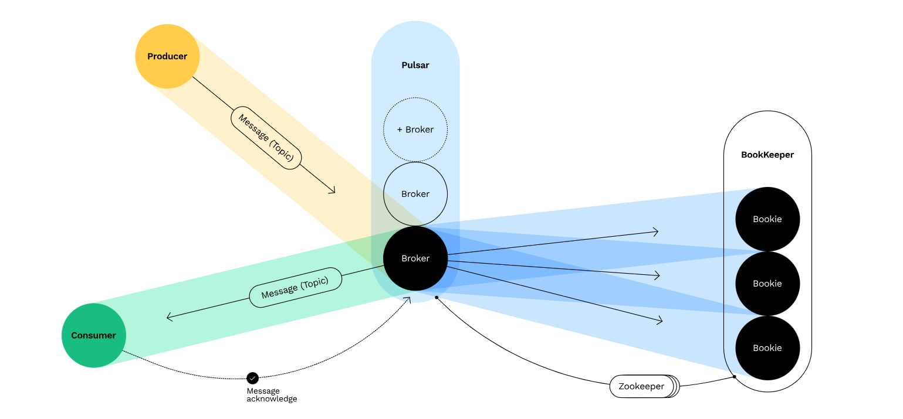

# spring-apache-pulsar


### Create Admin user :

```
CSRF_TOKEN=$(curl http://localhost:7750/pulsar-manager/csrf-token)

curl \
  -H "X-XSRF-TOKEN: $CSRF_TOKEN" \
  -H "Cookie: XSRF-TOKEN=$CSRF_TOKEN;" \
  -H "Content-Type: application/json" \
  -X PUT http://localhost:7750/pulsar-manager/users/superuser \
  -d '{"name": "admin", "password": "apachepulsar", "description": "test", "email": "username@test.org"}'
```

### Apache Pulsar architecture 




#### Create a Pulsar cluster
As preparation, create data directories and change the data directory ownership to uid(10000) which is the default user id used in the Pulsar Docker container.
```bash
sudo mkdir -p ./data/zookeeper ./data/bookkeeper
# this step might not be necessary on other than Linux platforms
sudo chown -R 10000 data
```

To create a Pulsar cluster by using the compose.yml file, run the following command.

` docker compose -f cluster-compose.yaml up -d`

For standalone use:

`docker compose -f standalone-compose.yaml up -d`

You can access the pulsar manager at http://localhost:9527

#### Starting the application

You can find the swagger url for the producer at `http://localhost:9191/swagger-ui/index.html`
